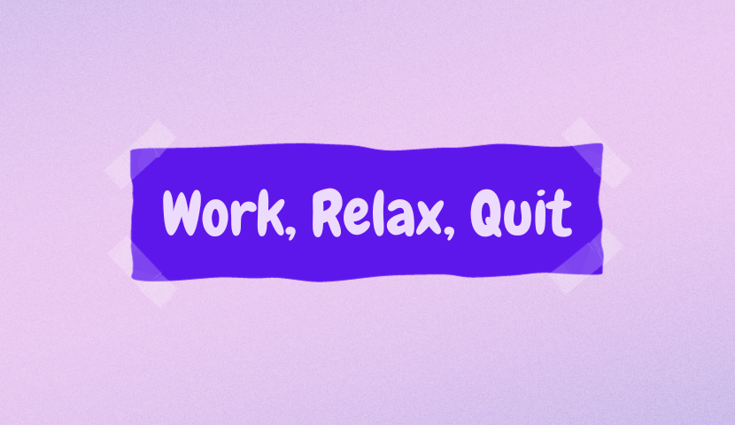

# Work Relax Quit

Work Relax Quit è la tua app tutto-in-uno per TFR, ferie, permessi, pianificazione delle vacanze e preavviso.
Rilassati, pianifica e gestisci il tuo futuro con facilità.

## Features

- **Calcolo ferie**: Work Relax Quit ti dice quando puoi prendere le ferie! Basta inserire i giorni che ti vuoi prendere, e l'app calcolerà automaticamente la prima data disponibile in base ai tuoi giorni accumulati.

- **Valore ferie**: sai quanto valgono le tue ferie? L'app calcola il loro valore in base al tuo salario e ai tuoi giorni di ferie disponibili.

- **Calcolo TFR (Trattamento di Fine Rapporto)**: pianificare il futuro è essenziale. Work Relax Quit ti consente di calcolare il TFR accumulato nel tempo, aiutandoti a visualizzare il tuo futuro finanziario quando deciderai di abbandonare il lavoro.

- **Calcolo dell'ultimo giorno di lavoro**: se stai pianificando il tuo licenziamento o la tua pensione, l'app ti aiuta a determinare l'ultimo giorno di lavoro in base alla data di comunicato licenziamento. Un modo semplice per pianificare il tuo futuro con precisione.

- **Gestione di ferie e permessi**: con Work Relax Quit, non dovrai più preoccuparti di tracciare manualmente ferie e permessi. L'app ti consente di aggiungere e eliminare ferie e permessi in modo efficiente, mantenendo sempre un registro aggiornato.

- **Night mode**

## Installa

## Ko-fi

## License

[GPL-3.0 License](COPYING)
